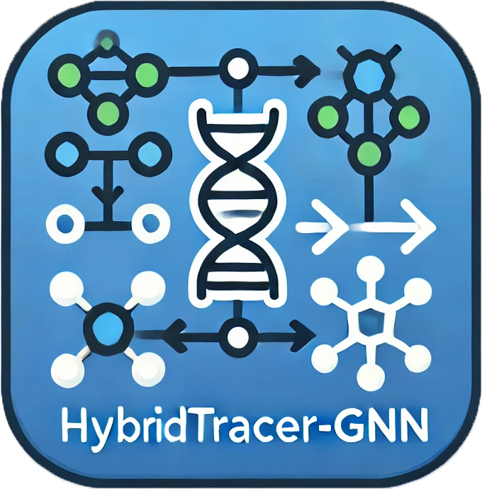

```
<div align="center">
  
#  HybridTracer-GNN </div> 

###############################################################################################################################

██╗  ██╗██╗   ██╗██████╗ ██████╗ ██╗██████╗ ████████╗██████╗  █████╗  ██████╗███████╗██████╗        ██████╗ ███╗   ██╗███╗   ██╗
██║  ██║╚██╗ ██╔╝██╔══██╗██╔══██╗██║██╔══██╗╚══██╔══╝██╔══██╗██╔══██╗██╔════╝██╔════╝██╔══██╗      ██╔════╝ ████╗  ██║████╗  ██║
███████║ ╚████╔╝ ██████╔╝██████╔╝██║██║  ██║   ██║   ██████╔╝███████║██║     █████╗  ██████╔╝█████╗██║  ███╗██╔██╗ ██║██╔██╗ ██║
██╔══██║  ╚██╔╝  ██╔══██╗██╔══██╗██║██║  ██║   ██║   ██╔══██╗██╔══██║██║     ██╔══╝  ██╔══██╗╚════╝██║   ██║██║╚██╗██║██║╚██╗██║
██║  ██║   ██║   ██████╔╝██║  ██║██║██████╔╝   ██║   ██║  ██║██║  ██║╚██████╗███████╗██║  ██║      ╚██████╔╝██║ ╚████║██║ ╚████║
╚═╝  ╚═╝   ╚═╝   ╚═════╝ ╚═╝  ╚═╝╚═╝╚═════╝    ╚═╝   ╚═╝  ╚═╝╚═╝  ╚═╝ ╚═════╝╚══════╝╚═╝  ╚═╝       ╚═════╝ ╚═╝  ╚═══╝╚═╝  ╚═══╝                         
                                                                                                                 
HybridTracer-GNN enables inference of hybrid speciation and admixture with fast graph neural network.                                                                   
Pypi: https://pypi.org/project/HybridTracer-GNN                                               
Github: https://github.com/YiyongZhao/HybridTracer-GNN                                        
Licence: MIT license                                                                     
Release Date: 2024-7                                                                     
Contacts: Xinzheng Du(duxz@xiaohuafund.com); Yiyong Zhao(yiyongzhao1991@gmail.com)
###############################################################################################################################
```                                                                        


[](http://hybridization-detection.readthedocs.io)
[](https://github.com/YiyongZhao/HybridTracer-GNN/issues)

[](https://pypi.python.org/pypi/HybridTracer-GNN)
<p align="center">
  
</p>

### Introduction
HybridTracer-GNN enables the inference of hybrid speciation and admixture using a fast graph neural network. Our work is implemented in PyTorch, utilizing the [SimGNN](https://github.com/benedekrozemberczki/SimGNN) framework for multiple sequence alignment embedding. However, the reference framework is also accessible in a TensorFlow implementation [here](https://github.com/yunshengb/SimGNN), and another implementation is available [here](https://github.com/NightlyJourney/SimGNN) for your information.


### Clone and install environment:

```bash
#A convenient one-click installation by using conda (https://docs.conda.io/projects/conda/en/stable/user-guide/install/index.html) with the following commands:
git clone https://github.com/YiyongZhao/HybridTracer-GNN.git
cd HybridTracer-GNN
conda env create -f environment.yml
conda activate HybridTracer-GNN

#Alternatively, a convenient one-click installation by using pip (the package installer for Python) with the following commands:
chmod +x install_packages.sh
bash install_package.sh

#Required dependencies:
Python 3.0+
  Python modules:
  networkx          2.4
  tqdm              4.28.1
  numpy             1.15.4
  pandas            0.23.4
  texttable         1.5.0
  scipy             1.1.0
  argparse          1.1.0
  torch             1.1.0
  torch-scatter     1.4.0
  torch-sparse      0.4.3
  torch-cluster     1.4.5
  torch-geometric   1.3.2
  torchvision       0.3.0
  scikit-learn      0.20.0
```
### Install from PyPI with pip:

```bash
pip install HybridTracer-GNN
```
## Usage 
### Datasets for GNN trainning
[JSON](https://www.json.org/json-en.html) (JavaScript Object Notation) is a lightweight data-interchange format that is both human-readable and machine-parsable, facilitating straightforward data exchange. Each MSA (Multiple Sequence Alignment) file is stored in JSON format, represented as a collection of graphs. In these graphs, each node ID and node label are indexed from 0 to 14, corresponding to the 15 patterns specified in the table below:
| **Pattern** | **Node ID** |
|:-------------| :------------:|
| AAAA | 0 |
| AAAD | 1 |
| AACA | 2 |
| AACC | 3 |
| AABD | 4 |
| ABAA | 5 |
| ABAB | 6 |
| ABAD | 7 |
| ABBA | 8 |
| ABBB | 9 |
| ABBD | 10 |
| ABCA | 11 |
| ABCB | 12 |
| ABCC | 13 |
| ABCD | 14 |


Every JSON file has the following key-value structure:

```javascript
{"graph_1": [[0, 1], [1, 2], [2, 3], [3, 4]],
 "labels_1": [2, 2, 2, 2, 2, 2, 2, 2, 2, 2, 2, 2, 2, 2, 2],
 "ged": 2}
```
<p align="justify">
The **graph_1** keys have edge list values which descibe the connectivity structure. Similarly, the **labels_1** keys have labels for each node which are stored as list - positions in the list correspond to node identifiers. The **ged** key has an integer value which is hybrid attribute value, in our example 2 = Hybird, 4 = Admixture, 6 = Admix with gene flow, 8 = No hybird.</p>

### Example Input Format of Multiple Sequence Alignment （MSA）

The [PHYLIP](https://www.phylo.org/index.php/help/phylip) (Phylogeny Inference Package) format is a widely used text format for storing multiple sequence alignments in bioinformatics.

To get started quickly, follow these steps:

1. **Place Your MSA**:

   Place your MSA file with the ".phy" extension into the "phy" folder.

2. **Format Your MSA**:

   Ensure your ".phy" file is formatted as shown in the following example:

   - For each species, you can concatenate many orthologous coding genes into a supermatrix with the PHYLIP format.
   - Additionally, you can convert a VCF file to a supermatrix in PHYLIP format from genomic DNA data at the individual level after reference genome alignment using aligners such as [GATK](https://gatk.broadinstitute.org/hc/en-us).

3. **Supermatrix Length**:
   Ideally, the length of an input supermatrix alignment should be longer than 50,000 base pairs to provide sufficient power for significant inference, as estimated by previous phylogenetic invariants arising under the coalescent model with hybridization, using [HyDe](https://github.com/pblischak/HyDe).

### Example Supermatrix with PHYLIP File Format
```
-----------example_MSA_with_sps_level.phy-----------------------------------------------------------------------------------------
sps1	GAAGTTAGTA-TGA-ACTGATTAGGTTCCTTGAC-TTAGTACTGATAC-ATTAGGTTCCTCTGAC-TTAGTACTGATAC-ATTAGGTTCCTCGAC-TTAGTACTGA-ACTGA--AGGTTCCTTT
sps2	GAC-TTAGTACTGA-ACTGA--AGGTTCCTTGAC-TTAGTACTGA-ACTGA--AGGTTCCTTGAC-TTAGTACTGATAC-ATTAGGTTCCTCGAC-TTAGTACTGA-ACTGA--AGGTTCCTTT
sps3	GAC-TTAGT-CTGATACTGATGAGGTTCCTTGAC-TTAGTACTGA-ACTGA--AGGTTCCTTGAC-TTAGTACTGATAC-ATTAGGTTCCTCGAC-TTAGTACTGA-ACTGA--AGGTTCCTTT
sps4	GAC-TTAGTACTGATAC-ATTAGGTTCCTCGAC-TTAGTACTGA-ACTGA--AGGTTCCTTTGAC-TTAGTACTGATAC-ATTAGGTTCCTCGAC-TTAGTACTGA-ACTGA--AGGTTCCTTT
...
...
spsN	GAACTGAGTACTGATACTGATTAGGTTCCTTGAC-TTAGTACTGA-ACTGA--AGGTTCCTTGAC-TTAGTACTGATAC-ATTAGGTTCCTCGAC-TTAGTACTGA-ACTGA--AGGTTCCTTT
```
```
-----------example_MSA_with_pop_level.phy---------------------------------------------------------------------------------------------
sps1_pop1	GAAGTTAGTA-TGA-ACTGATTAGGTTCCTTGAC-TTAGTACTGA-ACTGA--AGGTTCCTTGAC-TTAGTACTGATAC-ATTAGGTTCCTCGAC-TTAGTACTGA-ACTGA--AGGTTCCTTT
sps1_pop2	GAC-TTAGTACTGA-ACTGA--AGGTTCCTTGAC-TTAGTACTGATAC-ATTAGGTTTCCTCGAC-TTAGTACTGATAC-ATTAGGTTCCTCGAC-TTAGTACTGA-ACTGA--AGGTTCCTTT
sps3_pop1	GAC-TTAGT-CTGATACTGATGAGGTTCCTTGAC-TTAGTACTGATAC-ATTAGGTTTCCTCGAC-TTAGTACTGATAC-ATTAGGTTCCTCGAC-TTAGTACTGA-ACTGA--AGGTTCCTTT
sps4_pop1	GAC-TTAGTACTGATAC-ATTAGGTTTCCTCGAC-TTAGTACTGATAC-ATTAGGTTTCCTCGAC-TTAGTACAGATAC-ATTAGGTTTCCTCGAC-TTAGTACTGATAC-ATTAGGTTTCCTC
sps4_pop2	GAC-TTAGTACAGATAC-ATTAGGTTTCCTCGAC-TTAGTACTGATAC-ATTAGGTTTCCTCGAC-TTAGTACAGATAC-ATTAGGTTTCCTCGAC-TTAGTACTGATAC-ATTAGGTTTCCTC
sps4_pop3	GAC-TTAGTACTGGTAC-ATTAGGTTTCCTCGAC-TTAGT-CTGATACTGATGAGGTTCCTTGAC-TTAGTACTGAC-TTAGTACAGATAC-ATTAGGTTTCCTCGAC-TTAGTACTGATAC-A
...
...
spsN_pop1	GAACTGAGTACTGATACTGATTAGGTTCCTTGAC-TTAGTACTGATAC-ATTAGGTTTCCTCGAC-TTAGTACAGATAC-ATTAGGTTTCCTCGAC-TTAGTACTGATAC-ATTAGGTTTCCTC

```
Note that the length of sequence names can vary, but each line must be arranged in the format: "sequence name" + "\t" + "sequence". Additionally, each sequence must have the same length.

How to concatenated orthologous multiple sequnce alignet (each sample with single copy gene) into a supermatirx with phylip format, we provdie a python scirpt:  [``concat_msa.py``](https://github.com/YiyongZhao/Hybrid_Tracer-GNN/blob/main/concat_msa.py)

Place your fasta multiple sequence alignment files with extensions .fas, .fa, or .fasta into a directory, e.g., MSA_dir. Run the script as follows:
This script processes `.fas`, `.fasta`, or `.fa` files in a specified directory and concatenates them into a supermatrix in PHYLIP format. The output file is saved in the current working directory.

```
python concat_msa.py MSA_dir
```
The script will generate a concatenated supermatrix in PHYLIP format and save it in the current directory. The output filename will follow the format: <number_of_samples>samples_<number_of_genes>genes_<sequence_length>bp_concatenate.phy.

### Examples
<p align="justify">
To start it quickly, after input your ".phy" files into "phy" folder, run "example.py".

```
python3 example.py
```

We **strongly recommend** placing the outgroup as the first line in the ".phy" file if you can identify which one is the outgroup, then run "outgroup.py" instead of running "example.py".

```
python3 outgroup.py
```

If you want train your own model:

The following commands learn a neural network and score on the test set. Training a GNN model on the default dataset.</p>

```
python src/main.py
```
<p align="center">

</p>

Training a GNN model for a 100 epochs with a batch size of 512.
```
python src/main.py --epochs 100 --batch-size 512
```
Training a GNN with histogram features.
```
python src/main.py --histogram
```
Training a GNN with histogram features and a large bin number.
```
python src/main.py --histogram --bins 32
```
Increasing the learning rate and the dropout.
```
python src/main.py --learning-rate 0.01 --dropout 0.9
```
You can save the trained model by adding the `--save-path` parameter.
```
python src/main.py --save-path /path/to/model-name
```
Then you can load a pretrained model using the `--load-path` parameter; **note that the model will be used as-is, no training will be performed**.
```
python src/main.py --load-path /path/to/model-name
```

### Options
<p align="justify">
Training a GNN model is handled by the `src/main.py` script which provides the following command line arguments.</p>

#### Input and output options
```
  --training-graphs   STR    Training graphs folder.      Default is `dataset/train/`.
  --testing-graphs    STR    Testing graphs folder.       Default is `dataset/test/`.
```
Please **note that the trainset and testset folder must end with "/" !**
#### Model options
```
  --filters-1             INT         Number of filter in 1st GCN layer.       Default is 128.
  --filters-2             INT         Number of filter in 2nd GCN layer.       Default is 64. 
  --filters-3             INT         Number of filter in 3rd GCN layer.       Default is 32.
  --bottle-neck-neurons   INT         Bottle neck layer neurons.               Default is 16.
  --bins                  INT         Number of histogram bins.                Default is 16.
  --batch-size            INT         Number of pairs processed per batch.     Default is 128. 
  --epochs                INT         Number of GNN training epochs.           Default is 5.
  --dropout               FLOAT       Dropout rate.                            Default is 0.5.
  --learning-rate         FLOAT       Learning rate.                           Default is 0.001.
  --weight-decay          FLOAT       Weight decay.                            Default is 10^-5.
  --histogram             BOOL        Include histogram features.              Default is False.
```

### Output
<p align="justify">
The output files default to being saved in the "outputfiles" folder, which records the probabilities of hybridization, admixture, admixture with gene flow, and no hybridization events. In cases where hybridization occurs, an additional "*_gamma.log" files are generated, containing records of gamma values.

## Bug Reports
You can report bugs or request features through our [GitHub Issues page](https://github.com/YiyongZhao/HybridTracer-GNN/issues). If you have any questions, suggestions, or issues, please do not hesitate to contact us.

## Contributing
If you're interested in contributing code or reporting bugs, we welcome your ideas and contributions to improve HybridTracer-GNN! Please check out [Contribution Guidelines](https://docs.github.com/en/issues).

## Version History
Check the [Changelog](https://github.com/YiyongZhao/HybridTracer-GNN/commits/HybridTracer-GNN_v1.0.0) for details on different versions and updates.

## License
HybridTracer-GNN  is licensed under the [MIT LICENSE](LICENSE).


